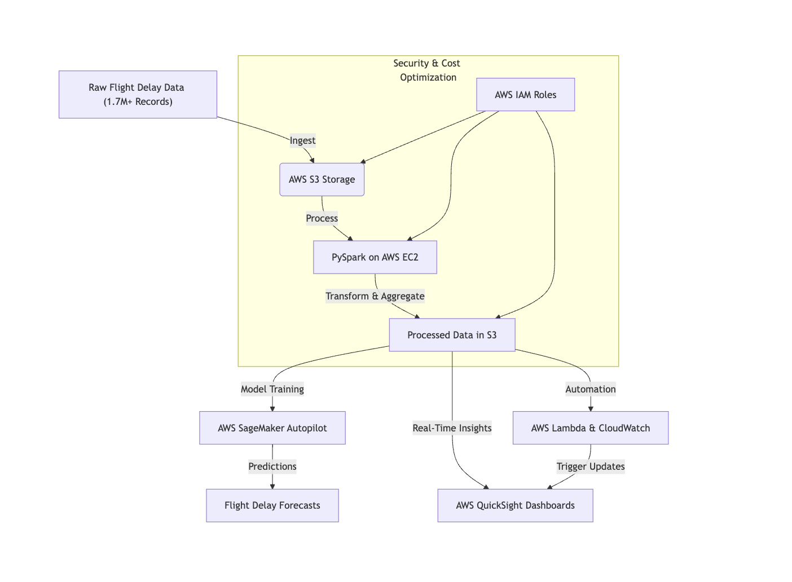
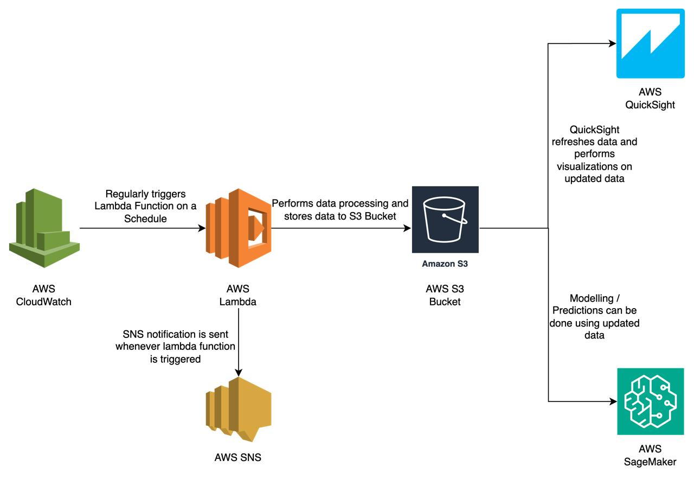
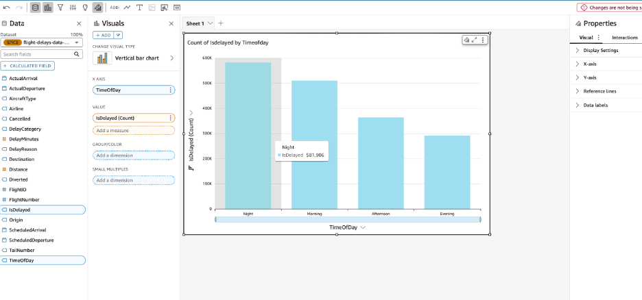
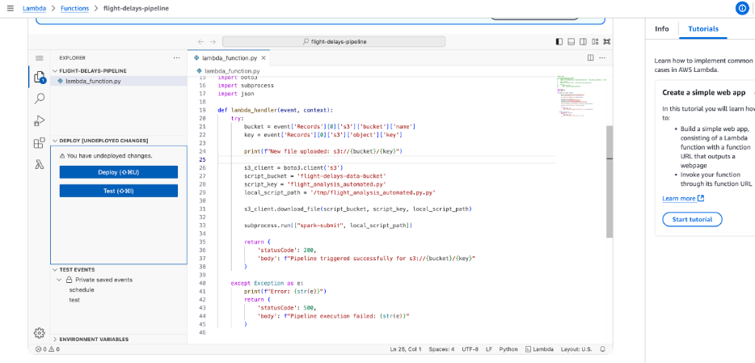
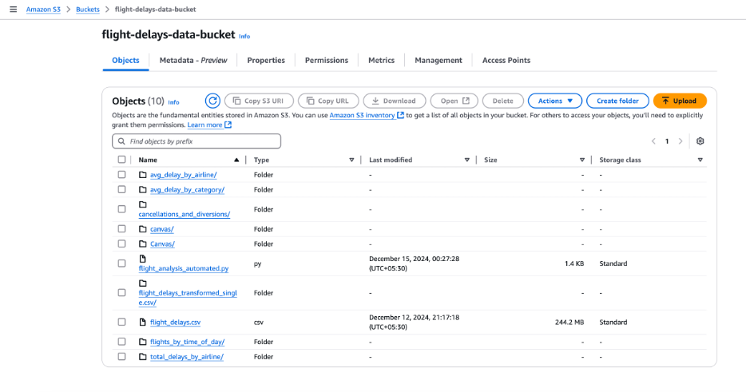
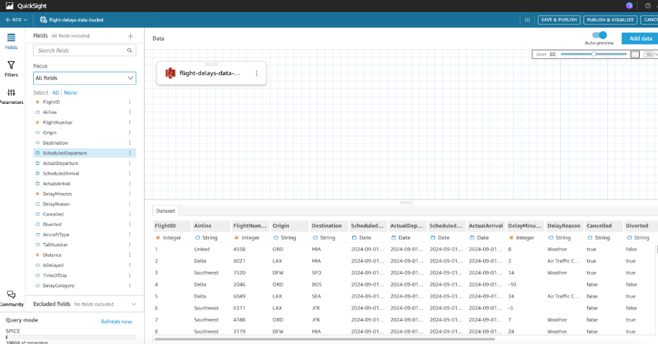

# ✈️ Flight Delay Analysis using AWS (Big Data Pipeline)

**Technologies:** Python, PySpark, AWS (S3, EC2, SageMaker, QuickSight), Linux, AutoML

## 📌 Project Description
Designed and implemented a distributed big data processing pipeline using PySpark on AWS to handle large-scale datasets efficiently for flight delay analysis and visualization. This project demonstrates hands-on experience with AWS services like S3, EC2, SageMaker, and QuickSight, showcasing skills in data storage, processing, and analysis in the cloud.

## Key Achievements

✔   **Scalable Data Processing:** Managed and processed large flight delay datasets using PySpark and AWS S3, ensuring efficient and scalable data handling. \
✔   **Distributed Computing Environment:** Configured AWS EC2 instances with Linux to create a scalable distributed computing environment for PySpark, optimizing performance for big data processing. \
✔   **Automated Machine Learning:** Developed AutoML models using SageMaker Autopilot to predict flight delays, improving prediction accuracy without manual hyperparameter tuning and streamlining the model development process. \
✔   **Interactive Data Visualization:** Built interactive dashboards using AWS QuickSight for dynamic data visualization, enabling insightful exploration of flight delay trends and patterns. \
✔   **AWS Infrastructure Management:** Navigated AWS IAM roles, cost optimization strategies, and security policies to ensure scalable, cost-efficient, and secure data processing workflows.

## 🏗️ Project Architecture
This project leverages multiple AWS services for **end-to-end automation**:

## ⏳ Data Flow Diagram

## 📊 QuickSight Dashboard

## Data Description

The flight delay data used in this project contains information about flights, including their origin, destination, scheduled departure time, actual departure time, and any delays encountered. The data is stored in a CSV file in an S3 bucket. Key attributes include:

*   FlightID: Unique identifier for each flight
*   Airline: Name of the airline
*   Origin: Origin airport code
*   Destination: Destination airport code
*   ScheduledDeparture: Scheduled departure time
*   DelayMinutes: Delay in minutes
*   DelayReason: Reason for the delay

The data was transformed to create new features such as `IsDelayed`, `TimeOfDay`, and `DelayCategory` to facilitate analysis.

## Code Description

The repository contains the following code files:

*   `Flight_Analysis_lambda_function.py`: This Python script is designed to run as an AWS Lambda function. It reads flight delay data from a CSV file in an S3 bucket, processes the data, and writes the processed data back to another CSV file in the same S3 bucket.
*   `flight_analysis.py`: This is a Spark script for processing flight delay data. It reads data from an S3 bucket, performs some EDA and data transformations, and then saves the processed data back to S3. It also includes some Spark SQL queries for further analysis.

## References

1. https://stackoverflow.com/questions/59430965/aws-how-to-install-java11-on-an-ec2-linux-machine
2. https://www.youtube.com/watch?v=t71VWv0bWVA
3. https://www.geeksforgeeks.org/introduction-to-aws-lambda/
4. https://docs.aws.amazon.com/AWSEC2/latest/UserGuide/concepts.html
5. https://www.kaggle.com/datasets/umeradnaan/flight-delays-dataset

## Screenshots 

1. **Lambda Function**

2. **S3 Bucket**

3. **Quicksight Dashboatd**

